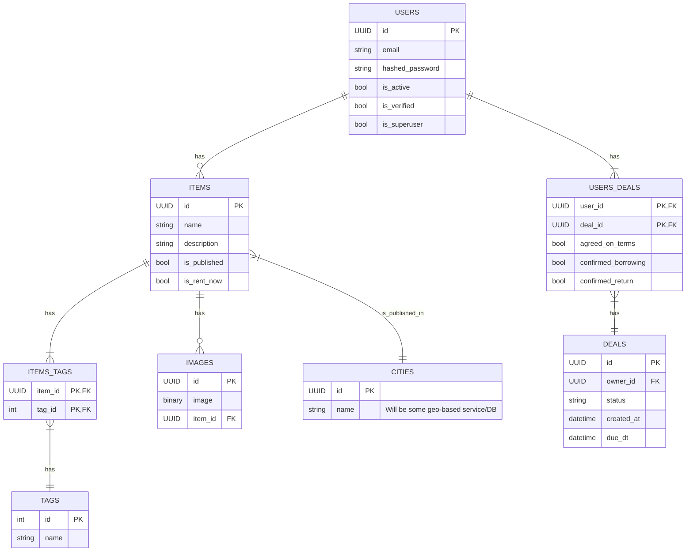

# Entity-Relationship Diagram (ERD)

```mermaid
erDiagram

    USERS {
        UUID id PK
        string email
        string hashed_password

        bool is_active
        bool is_verified
        bool is_superuser
    }

    ITEMS {
        UUID id PK
        string name
        string description
        bool is_published
        bool is_rent_now
    }

    ITEMS_TAGS {
        UUID item_id PK, FK
        int tag_id PK, FK
    }

    TAGS {
        int id PK
        string name
    }

    IMAGES {
        UUID id PK
        binary image
        UUID item_id FK
    }

    CITIES {
        UUID id PK
        string name "Will be some geo-based service/DB"
    }

    USERS_DEALS {
        UUID user_id PK, FK
        UUID deal_id PK, FK
        bool agreed_on_terms
        bool confirmed_borrowing
        bool confirmed_return
    }

    DEALS {
        UUID id PK
        UUID owner_id FK

        string status

        datetime created_at
        datetime due_dt
    }

    USERS || -- o{ ITEMS : has
    USERS || -- |{ USERS_DEALS : has
    USERS_DEALS }| -- || DEALS : has

    ITEMS || -- o{ IMAGES: has
    ITEMS }| -- || CITIES : is_published_in
    ITEMS || -- |{ ITEMS_TAGS : has
    ITEMS_TAGS }| -- || TAGS : has
```
