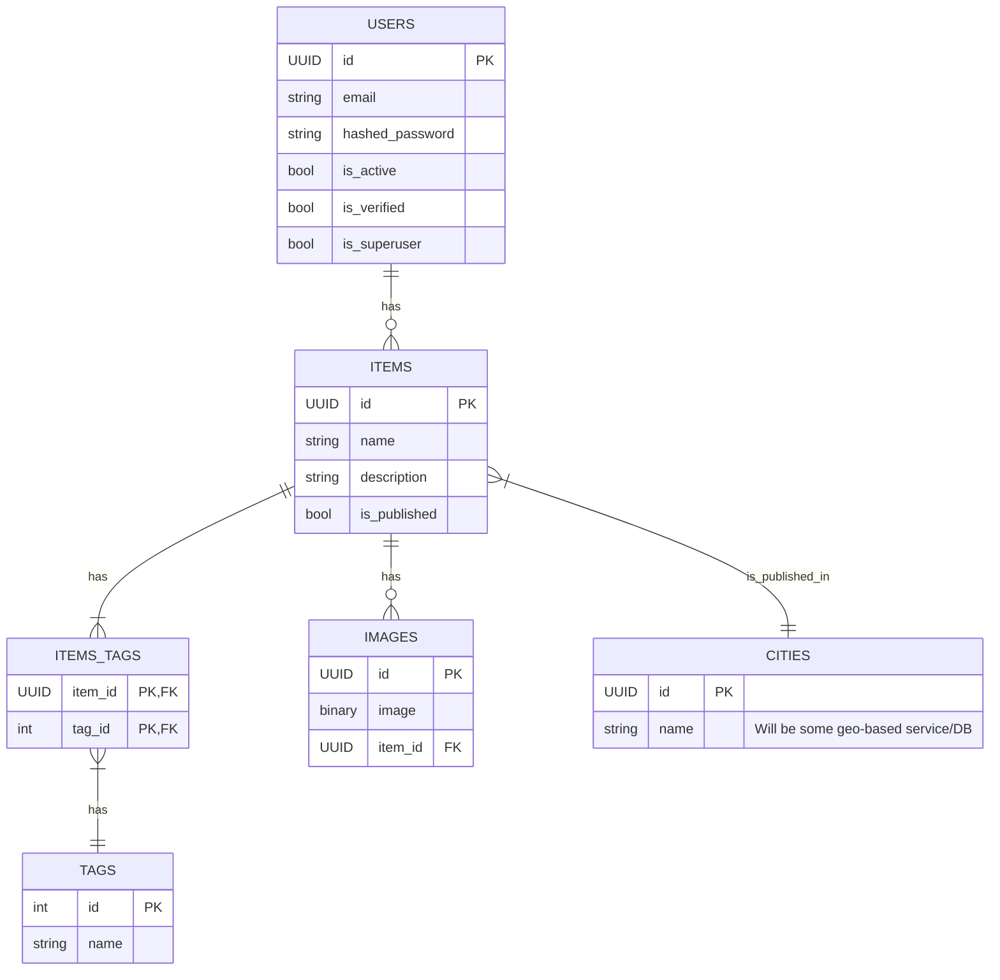

# Entity-Relationship Diagram (ERD)

```mermaid
erDiagram

    USERS {
        UUID id PK
        string email
        string hashed_password

        bool is_active
        bool is_verified
        bool is_superuser
    }

    ITEMS {
        UUID id PK
        string name
        string description
        bool is_published
    }

    ITEMS_TAGS {
        UUID item_id PK, FK
        int tag_id PK, FK
    }

    TAGS {
        int id PK
        string name
    }

    IMAGES {
        UUID id PK
        binary image
        UUID item_id FK
    }

    CITIES {
        UUID id PK
        string name "Will be some geo-based service/DB"
    }

    USERS || -- o{ ITEMS : has
    ITEMS || -- o{ IMAGES: has
    ITEMS }| -- || CITIES : is_published_in
    ITEMS || -- |{ ITEMS_TAGS : has
    ITEMS_TAGS }| -- || TAGS : has
```
