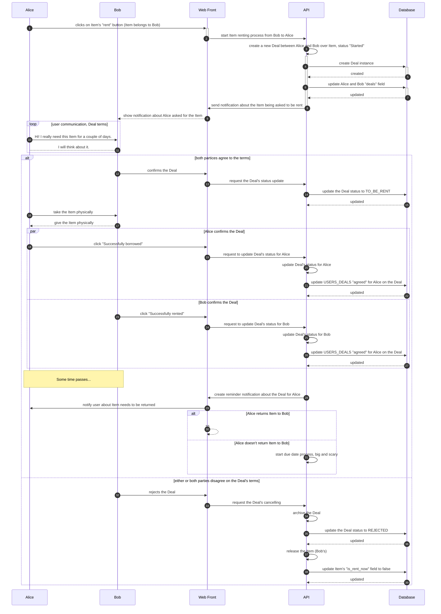

Base operations.

# Making a Deal between two Users
Alice wants to borrow (rent) the Item from Bob.

```mermaid
sequenceDiagram
    autonumber

    participant ua as Alice
    participant ub as Bob
    participant front as Web Front
    participant api as API
    participant db as Database

    ua ->>+ front: clicks on Item's "rent" button (Item belongs to Bob)
    front ->>- api: start Item renting process from Bob to Alice

    api ->>+ api: create a new Deal between Alice and Bob over Item, status "Started"
    api ->>+ db: create Deal instance
    db -->>- api: created
    api ->>+ db: update Alice and Bob "deals" field
    db -->>- api: updated
    api ->>- front: send notification about the Item being asked to be rent
    front -->> ub: show notification about Alice asked for the Item

    loop user communication, Deal terms
        ua ->> ub: Hi! I really need this Item for a couple of days.
        ub --> ua: I will think about it.
    end

    alt both partices agree to the terms
        ub ->> front: confirms the Deal
        front ->> api: request the Deal's status update
        api ->> db: update the Deal status to TO_BE_RENT
        db -->> api: updated

        ua ->> ub: take the Item physically
        ub -->> ua: give the Item physically

        par Alice confirms the Deal
            ua ->> front: click "Successfully borrowed"
            front ->> api: request to update Deal's status for Alice
            api ->> api: update Deal's status for Alice
            api ->> db: update USERS_DEALS "agreed" for Alice on the Deal
            db -->> api: updated
        and Bob confirms the Deal
            ub ->> front: click "Successfully rented"
            front ->> api: request to update Deal's status for Bob
            api ->> api: update Deal's status for Bob
            api ->> db: update USERS_DEALS "agreed" for Alice on the Deal
            db -->> api: updated
        end

        note over ua,ub: <br/>Some time passes...<br/>
        api ->> front: create reminder notification about the Deal for Alice
        front ->> ua: notify user about Item needs to be returned

        alt Alice returns Item to Bob
            front -->> front: ss
        else Alice doesn't return Item to Bob
            api ->> api: start due date process, big and scary
            %% mark Alice bad (or ban entirely), mark deal broken (after usage?), mark Item not returned
        end

    else either or both parties disagree on the Deal's terms
        ub ->> front: rejects the Deal
        front ->> api: request the Deal's cancelling
        api ->> api: archive the Deal
        api ->> db: update the Deal status to REJECTED
        db -->> api: updated
        api ->> api: release the Item (Bob's)
        api ->> db: update Item's "is_rent_now" field to false
        db -->> api: updated
    end

```
